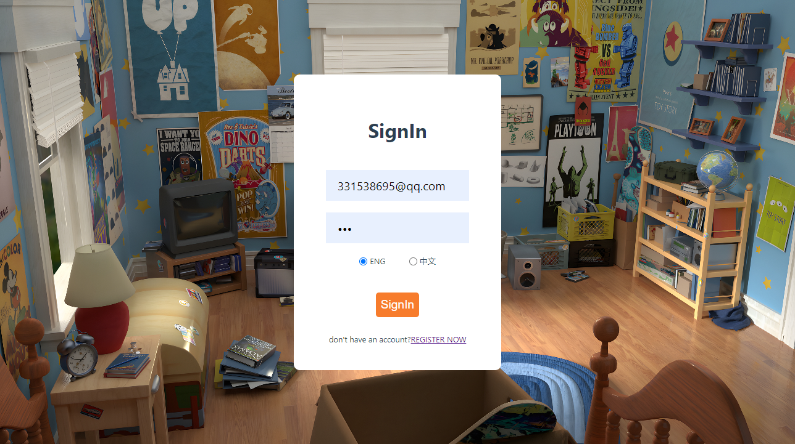

# SandCat

## Technical Implementation

Our software has primarily implemented the basic functionalities of an IM application, which includes a fundamental friend system, one-on-one chat, group chat, and one-on-one audio/video calls. It also supports i18n and currently offers a switch between Chinese and English.

### One-on-One Chat/Group Chat

We have implemented the real-time message exchange for individual and group chats using the WebSocket protocol. Messages, upon being received, are processed according to their types. Main features and implementation details include:

1. Real-time Message Transmission:
   - All instant communication interactions are completed via the WebSocket protocol, ensuring efficient bidirectional communication with low latency.
2. Message Sequence Verification:
   - Each message is accompanied by a sequential identifier (sequence). The client uses this sequence to check for any missing messages.
   - Should message loss be detected, the system will perform necessary retrieval by comparing the local and server sequence records.
3. Message Storage Mechanism:
   - Processed messages are securely saved to the IndexedDB database, facilitating future user searches and views, thereby achieving persistent storage locally.
4. Reconnection Strategy:
   - An intrinsic reconnection mechanism allows automatic attempts to re-establish a WebSocket connection upon unexpected disconnections, ensuring continuity in user experience.
5. Front-end Technical Implementation:
   - Focusing on leveraging Rust's features, such as closures, callback functions, and lifecycle management, the front end emphasizes a lightweight yet efficient client-side communication.

By synthesizing these strategies and technologies, the messaging system for both one-on-one and group chats aims to provide a continuous and seamless communication experience. We are committed to utilizing advanced front-end technology to ensure the stability and security of message transmissions, meeting various needs of users in their daily communications.

### Friend System

 The system combines HTTP requests with WebSocket communication to ensure efficiency and real-time functionality. The friend system involves the following modules:

1. Friend Search Functionality:
   - Users can search for friends using phone numbers, email addresses, or user account names.
   - The search operation is implemented using HTTP and currently only supports exact matching.
2. Add Friend Requests:
   - After obtaining search results, users can submit required application information through an HTTP request to initiate the process of adding a friend.
   - Upon receiving an addition request, the server employs WebSocket to transmit the request information to the recipient in real-time, ensuring timely notification.
   - Request data is also recorded in the database and stored in the recipient's inbox, allowing offline users to receive friend request notifications later.
3. Handling Friend Requests:
   - The recipient can view and address friend requests either online or upon the next login.
   - Actions for handling friend requests, such as accepting, are also carried out via HTTP and submitted to the server.
   - The server relays the outcome through WebSocket instantaneously to the requester and logs it in the database and the requester's inbox, thereby notifying even when the requester is offline.

This design ensures instant response and data consistency in user interactions while implementing the foundational functions of the friend system. The current design of the friend system is fragile and limited and will undergo restructuring in the future.

### Group Chat

Group chat features include creating group chats, inviting new members, exiting group chats, and disbanding them, with relatively straightforward client-side logic.

#### Creating Group Chats

Users can easily create a group chat and invite their friends to join. The implementation process is as follows:

- Users select the friends they wish to invite and click the "Create Group Chat" button in the app. The client then collects and sends the invitees' member IDs, avatars, and other necessary information to the server.
- After processing this information, the server creates the group chat and returns detailed information, including the group chat ID, member list, and general group information.
- The client updates the local database upon receiving this information, including the group chat info table and group chat members table, ensuring that the user interface promptly reflects the newly created group chat and its members.
- Invited members receive a notification via WebSocket that includes detailed group chat information and the member list. They must update the related information in their local tables to complete the joining process.

#### Inviting New Members

Existing group chat members can invite more friends to join through an "Invite Members" option on the interface.

- After confirming the invitation, the client sends the information of the invitees to the server, requesting an update to the group chat member list.
- The server updates the relevant group chat database information upon processing this request and notifies all group members of the new addition.
- New members receive a WebSocket message with a group chat invite, including the basic details and existing member list. Once the invitation is accepted, the new member updates the group chat information in their local database, completing the joining process.

#### Exiting and Disbanding Group Chats

- **Exiting a Group Chat**: Users can opt to leave a group chat, prompting the client to send a request to the server. After processing, the server removes the member from the list and notifies the remaining group members via WebSocket.
- **Disbanding a Group Chat**: The group owner has the authority to disband the group. Upon executing the disbandment, the server deletes all records of the chat and notifies all members of its dissolution via WebSocket. Clients remove the group chat information from their local databases upon notification.

### Audio/Video Calls

Audio and video calling are implemented using the browser's native API--WebRTC, which stands as a challenging aspect of the project. Here is a detailed introduction:

Sequence Diagram

WebRTC technology enables audio and video call functionalities for our instant messaging service. Its core is built on our WebSocket service and exchanges necessary Point-to-Point (P2P) connection information between users through the "signalling channel," such as media information (codec support), network information (including IP addresses and ports), and session control messages for call handling. Before starting to exchange these P2P connection details, a call invitation needs to be sent to the receiver. The entire process is as follows:

1. **Sending a Call Invitation**: Initially, User A sends a call invitation to User B by clicking the call button.
2. **Receiving a Call Invitation**: Upon notification, User B can accept or reject the call. If User B accepts, the system begins establishing a P2P connection.
3. **Creating an "RTCPeerConnection" Object**: The system creates an RTCPeerConnection object in each participating user's browser to manage the lifecycle of the WebRTC connection.
4. **Exchanging Network Information (ICE Candidates)**: This is to inform both parties about each other's network environments, including IP addresses and ports.
5. **Exchanging Session Descriptions (SDP)**: This step is to let both parties know the media parameters used in the call, like the type of media and codecs involved.
6. **NAT Traversal and Relay (STUN/TURN)**: To address users located behind NATs or firewalls, WebRTC uses STUN and TURN servers to discover the device's public IP address and ports, and if necessary, relay traffic through the TURN server.
7. **Establishing Connection**: After exchanging ICE candidates and session descriptions (SDP), the system attempts to establish a connection, first trying for a direct connection between the call parties and using the TURN server for relaying if required.
8. **Media Stream Transmission**: Once a connection is established, the transfer of media streams, like video and audio, can begin.
9. **Communication and Maintenance**: During the call, the system maintains the status of the other party, timely updating ICE candidates to ensure call stability.
10. **Closing Connection**: After the call ends, the RTCPeerConnection must be closed to terminate the session.

Except for establishing the P2P connection, which WebRTC handles automatically, other aspects like call invitations, call invitation cancellations, call timeouts, call hang-ups, etc., require our design and implementation. Overall,

### design rendering

- login

- register

- friend application

- conversation

- friend list

